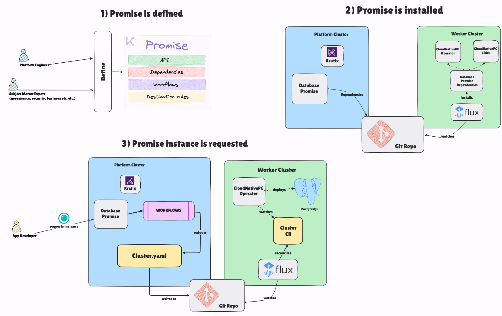
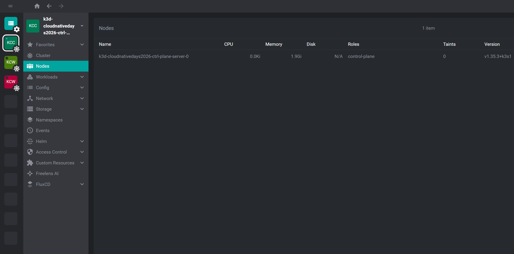
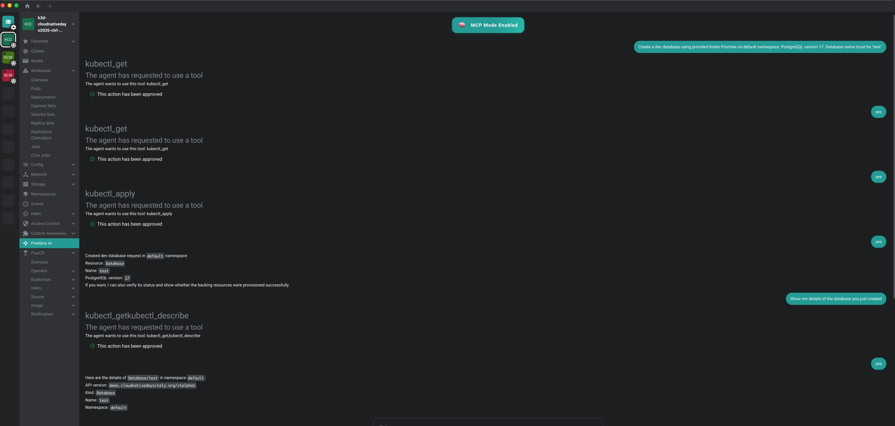
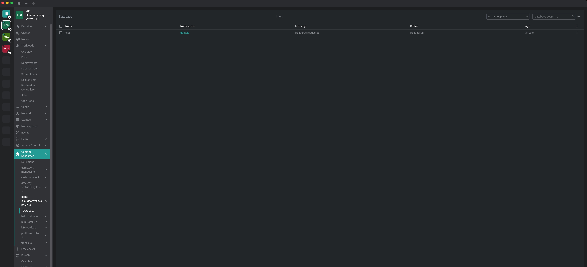
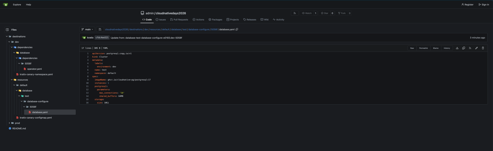
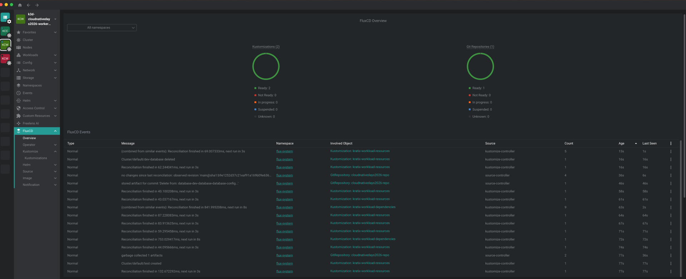
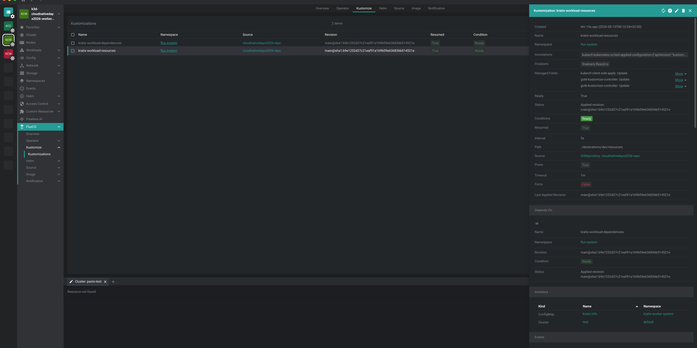
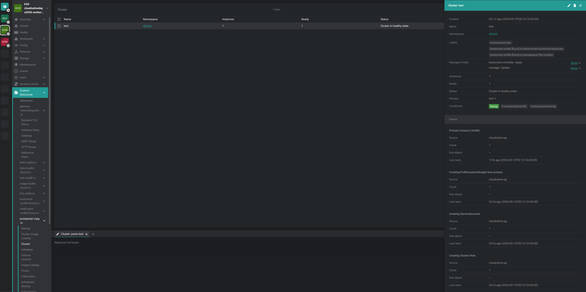
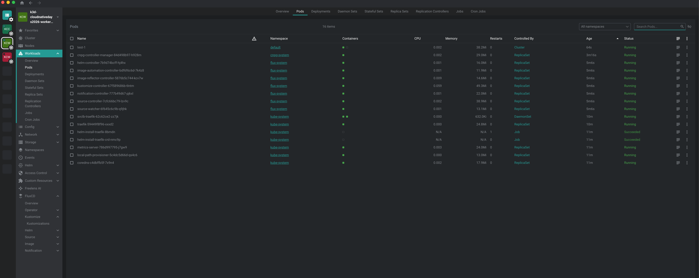

# Freelens + Platform Engineering — Cloud Native Days Italy 2026

> Demo repository for the talk **"Freelens: un progetto open source italiano, aperto, meritocratico e costruito dai suoi utilizzatori"**
> at [Cloud Native Days Italy 2026](https://cloudnativedaysitaly.org/).

[Freelens](https://freelensapp.github.io/) is a free, open-source Kubernetes IDE maintained by the community. This talk uses Freelens as the main interface to interact with the demo — browsing clusters, inspecting custom resources, and watching the platform in action — while showcasing how Platform Engineering concepts can be put into practice.

The **Platform Engineering** part of the demo is a **proof-of-concept** built with [Kratix](https://kratix.io/): a platform team installs a `Database` Promise once, and developers can self-serve PostgreSQL clusters on demand without knowing anything about the underlying infrastructure.

The entire local environment — three k3d clusters, Kratix, Gitea, Flux, and a database Promise — is bootstrapped with a single command.

---

## What this demo shows

[Freelens](https://freelensapp.github.io/) is used throughout the demo as the primary Kubernetes UI — connecting to all three clusters, browsing CRDs, inspecting running pipelines, and observing CloudNativePG clusters being provisioned in real time.

The demo walks through two scenarios:

1. **Developer self-service (Promise v0.0.1)** — A developer creates a `Database` custom resource on the platform control plane. Kratix processes the request, generates environment-aware [CloudNativePG](https://cloudnative-pg.io/) manifests, and delivers them to the right cluster via GitOps (Gitea + Flux). Dev databases are routed to the dev cluster; prod databases are routed to the prod cluster, each with appropriate tuning.

2. **Platform upgrade (Promise v0.0.2)** — A platform engineer upgrades the `Database` Promise to add High Availability support. All existing databases are automatically reconciled to the new configuration (3 replicas) without any action from the developer.

This illustrates the core value of Kratix: **the platform team defines the contract; developers consume it; infrastructure follows automatically.**

---

## Architecture

Three [k3d](https://k3d.io/) clusters share a Docker bridge network for cross-cluster Layer-3 connectivity:

```
┌─────────────────────────────────────────────────────────────┐
│                   Control Plane Cluster                      │
│         (cloudnativedays2026-ctrl-plane)                     │
│                                                              │
│   ┌───────────┐   ┌────────┐   ┌───────────────────────┐    │
│   │  Kratix   │──▶│ Gitea  │   │  cert-manager         │    │
│   │ (platform)│   │ (state │   │  (TLS for ingress)    │    │
│   └─────┬─────┘   │ store) │   └───────────────────────┘    │
│         │         └───┬────┘                                 │
└─────────┼─────────────┼───────────────────────────────────-─┘
          │ writes       │ GitRepository
          ▼             ▼
┌─────────────────┐  ┌──────────────────┐
│   Worker: dev   │  │   Worker: prod   │
│   (Flux CD)     │  │   (Flux CD)      │
│                 │  │                  │
│  CloudNativePG  │  │  CloudNativePG   │
│  Cluster (dev)  │  │  Cluster (prod)  │
└─────────────────┘  └──────────────────┘
```

| Cluster | k3d name | Components |
|---------|----------|------------|
| Control plane | `cloudnativedays2026-ctrl-plane` | cert-manager, Kratix, Gitea (Traefik ingress) |
| Dev worker | `cloudnativedays2026-worker-dev` | Flux CD, CloudNativePG operator |
| Prod worker | `cloudnativedays2026-worker-prod` | Flux CD, CloudNativePG operator |

### How the GitOps loop works

1. A developer applies a `Database` resource to the control plane.
2. Kratix triggers a **pipeline** (a container-based workflow) that:
   - reads the request parameters,
   - generates a CloudNativePG `Cluster` manifest with the right configuration,
   - writes the manifest to Gitea (the Git state store),
   - sets destination selectors so the manifest lands in the correct worker cluster (`environment: dev` or `environment: prod`).
3. Flux running in the worker cluster detects the new commit and applies the manifest.
4. CloudNativePG provisions the PostgreSQL cluster.

---

## Key concepts

| Concept | Description |
|---------|-------------|
| **Kratix Promise** | A CRD + workflow definition that the platform team installs on the control plane. It defines _what_ developers can request and _how_ those requests are fulfilled. |
| **Resource request** | A `Database` CR created by a developer. Kratix processes it through a pipeline. |
| **Pipeline** | A container that runs on every resource request. Written in Python using the [Kratix SDK](https://docs.kratix.io/main/reference/kratix-sdk). Produces output manifests and routing metadata. |
| **Destination** | A registered worker cluster. Kratix routes manifests to destinations based on label selectors. |
| **State Store** | A Gitea repository. Kratix writes output manifests here; Flux pulls from it. |

The diagram below illustrates the overall lifecycle of a Kratix Promise in this demo:

1. The **platform team** installs a Promise on the control plane, defining a new API (e.g. `Database`) and the pipeline that fulfils requests. Promise dependencies are propagated by Kratix to every destination target as they represent a pre-requisite via a GitOps-controlled flow.
2. A **developer** creates a resource request (`Database` CR) against that API.
3. Kratix runs the **pipeline** — a container that reads the request, generates infrastructure manifests (CloudNativePG `Cluster`), and writes them to the **Git state store** (Gitea) with destination selectors.
4. **Flux** on the target worker cluster detects the new commit, pulls the manifests, and applies them (like the dependencies one at Promise installation time)
5. **CloudNativePG** provisions the PostgreSQL cluster on the worker.



---

## Prerequisites

| Tool | Version | Notes |
|------|---------|-------|
| [Docker](https://docs.docker.com/get-docker/) | Any recent | Container runtime |
| [k3d](https://k3d.io/) | v5+ | Local multi-cluster |
| [kubectl](https://kubernetes.io/docs/tasks/tools/) | Any recent | — |
| [helm](https://helm.sh/) | v3+ | — |
| `curl` | — | Used during bootstrap |
| `envsubst` | — | Usually included in `gettext` |

**Open files limit** — k3d nodes may fail to start if the host inotify limit is too low. Run this before bootstrapping:

```bash
sudo sysctl fs.inotify.max_user_watches=524288
sudo sysctl fs.inotify.max_user_instances=512
```

For a permanent fix, add those lines to `/etc/sysctl.d/99-k3d.conf`. See also the [kind known issues page](https://kind.sigs.k8s.io/docs/user/known-issues/#pod-errors-due-to-too-many-open-files) — the same root cause applies to k3d.

**Corporate proxy / custom CA** — If your machine routes outbound TLS through a proxy (e.g. Zscaler), a CA certificate must be provided so that in-cluster processes can verify TLS connections. This is mounted into every k3d node automatically during bootstrap.

---

## Quick start

### 1. Add the Gitea hostname to `/etc/hosts`

The Gitea instance is exposed via Traefik using the k3d load-balancer container name as the hostname. Add this line to your hosts file so that both your browser and the worker clusters can reach it:

```
127.0.0.1   k3d-cloudnativedays2026-ctrl-plane-serverlb
```

> **WSL users**: if you run commands inside WSL but open the browser on Windows, add the same line to the Windows hosts file (`C:\Windows\System32\drivers\etc\hosts`) as well.

### 2. Bootstrap

```bash
make bootstrap HOST_CA_CERT_PATH=/path/to/ca.crt
```

`HOST_CA_CERT_PATH` is optional. When set, the file is mounted into every k3d node so that in-cluster processes can verify TLS connections through a corporate proxy (e.g. Zscaler). If your machine does not use a proxy, simply omit it.

Bootstrap is **idempotent** — re-running it on an existing environment skips already-complete steps.

What `make bootstrap` does, in order:

1. Checks prerequisites (`kubectl`, `helm`, `k3d`, `docker`, `curl`)
2. Creates a shared Docker bridge network
3. Creates the control-plane and two worker k3d clusters
4. Installs cert-manager on the control plane
5. Installs Kratix on the control plane
6. Deploys Gitea via Helm with Traefik ingress
7. Waits for Gitea to be reachable from inside the cluster
8. Creates the Gitea repository used as the GitOps state store
9. Installs Flux on both worker clusters
10. Applies Kratix `Destinations`, `GitStateStore`, and Flux `GitRepository` + `Kustomization` manifests
11. Builds and imports the Promise pipeline container images
12. Installs the `Database` Promise (v0.0.1)
13. Prints a summary

### 3. Access Gitea

```
http://k3d-cloudnativedays2026-ctrl-plane-serverlb/
```

| Field | Default |
|-------|---------|
| Username | `admin` |
| Password | `admin123!` |

The GitOps state store repository is at:

```
http://k3d-cloudnativedays2026-ctrl-plane-serverlb/admin/cloudnativedays2026
```

---

## Demo flows

You can run this demo using [Freelens](https://freelensapp.github.io/) (recommended) or by executing commands manually. See [DEMO-FLOWS.md](DEMO-FLOWS.md) for the full step-by-step runbook.

### Using Freelens (recommended)


In this demo, [Freelens](https://freelensapp.github.io/) acts as the UX layer for the entire platform experience — replacing the command line with a visual interface to connect to clusters, browse custom resources, monitor GitOps reconciliation, and even interact with the platform using natural language.

Freelens supports a rich ecosystem of community extensions that add capabilities on top of the core IDE. This walkthrough uses two of them:

- [freelens-ai-extension](https://github.com/freelensapp/freelens-ai-extension) — interact with cluster resources using natural language
- [freelens-fluxcd-extension](https://github.com/freelensapp/freelens-fluxcd-extension) — visualize FluxCD reconciliation status directly inside Freelens

#### 1. Connect to the control-plane cluster

After bootstrap, Freelens automatically picks up the three kubeconfig contexts created by k3d. Open Freelens and connect to the control-plane cluster (`k3d-cloudnativedays2026-ctrl-plane`).



#### 2. Create Database resources with the AI extension

Open the AI extension panel and ask it to create `Database` resources using natural language — for example:

> _"Create a dev Database named "dev-database" using provided Kratix Promise. Create it on default namespace and use PostgreSQL version 16."_

The AI extension translates your request into a `Database` CR and applies it to the control-plane cluster. Kratix picks it up and runs the pipeline.



You can see that the `Database` resource is reconciled and has been processed by Kratix by navigating to  **Custom Resources → demo.cloudnativedaysitaly.org**



#### 3. Verify on Gitea

Once Kratix completes the pipeline, the generated CloudNativePG manifests are pushed to the Gitea state store. Open the Gitea web UI to confirm the new commit appeared in the repository:

```
http://k3d-cloudnativedays2026-ctrl-plane-serverlb/admin/cloudnativedays2026
```



#### 4. Check reconciliation with the FluxCD extension

Switch to a worker cluster (e.g. `k3d-cloudnativedays2026-worker-dev`) and open the FluxCD extension panel. You will see the `GitRepository` and `Kustomization` objects syncing from Gitea and reconciling the CloudNativePG manifests into the destination cluster.




#### 5. Inspect the provisioned database

Still on the worker cluster, navigate to **Custom Resources → clusters.postgresql.cnpg.io** to see the CloudNativePG cluster that was provisioned automatically.



You can also see that the Database has started by looking at the running pods:



### Using the command line

#### Flow 1 — Developer self-service (Promise v0.0.1)

Apply the sample `Database` resources included in this repo:

```bash
# Request a dev database
kubectl --context k3d-cloudnativedays2026-ctrl-plane apply -f databases/dev-database.yaml

# Request a prod database
kubectl --context k3d-cloudnativedays2026-ctrl-plane apply -f databases/prod-database.yaml
```

Each resource is a simple YAML:

```yaml
# databases/dev-database.yaml
apiVersion: demo.cloudnativedaysitaly.org/v1alpha1
kind: Database
metadata:
  name: dev-database
spec:
  size: small
  environment_type: dev
  postgresql_version: 15
```

Kratix routes them to different clusters and applies environment-specific tuning:

| Parameter | Dev | Prod |
|-----------|-----|------|
| Instances | 1 | 1 |
| `max_connections` | 50 | 200 |
| `shared_buffers` | 64MB | 256MB |
| Backup | optional | always enabled (7-day retention) |
| Target cluster | `worker-dev` | `worker-prod` |

**Validation is enforced at the API level.** Trying to apply an invalid resource (e.g. `wrong-database.yaml` with `size: wrong`) is rejected immediately by Kubernetes:

```bash
kubectl --context k3d-cloudnativedays2026-ctrl-plane apply -f databases/wrong-database.yaml
# The Database "wrong-database" is invalid: spec.size: Unsupported value: "wrong"
```

#### Flow 2 — Platform upgrade with automatic reconciliation (Promise v0.0.2)

The platform engineer upgrades the Promise to v0.0.2, which adds a `ha` field (default: `true`, 3 replicas):

```bash
kubectl --context k3d-cloudnativedays2026-ctrl-plane apply -f promise/v0.0.2/promise.yaml
```

To trigger immediate reconciliation of already-existing databases (in case your environment does not auto-reconcile):

```bash
kubectl --context k3d-cloudnativedays2026-ctrl-plane -n default patch database dev-database \
  --type merge -p '{"spec":{"postgresql_version":15}}'

kubectl --context k3d-cloudnativedays2026-ctrl-plane -n default patch database prod-database \
  --type merge -p '{"spec":{"postgresql_version":17}}'
```

Both clusters are upgraded to 3-replica HA clusters without any developer involvement:

```bash
kubectl --context k3d-cloudnativedays2026-worker-dev -n default \
  get cluster dev-database -o jsonpath='{.spec.instances}{"\n"}'
# 3

kubectl --context k3d-cloudnativedays2026-worker-prod -n default \
  get cluster prod-database -o jsonpath='{.spec.instances}{"\n"}'
# 3
```

---

## Repository structure

```
.
├── Makefile                        # Single-command bootstrap and teardown
├── DEMO-FLOWS.md                   # Step-by-step demo runbook
├── databases/
│   ├── dev-database.yaml           # Sample dev Database resource
│   ├── prod-database.yaml          # Sample prod Database resource
│   └── wrong-database.yaml         # Negative test: validation rejection
├── promise/
│   ├── v0.0.1/                     # Promise v0.0.1 — single-instance databases
│   │   ├── promise.yaml            # Kratix Promise definition + CRD
│   │   ├── example-resource.yaml
│   │   └── workflows/
│   │       ├── promise/configure/  # Promise-level pipeline (installs CNPG operator)
│   │       └── resource/configure/ # Resource pipeline (generates CNPG Cluster manifests)
│   └── v0.0.2/                     # Promise v0.0.2 — adds HA support (ha: true by default)
│       ├── promise.yaml
│       └── workflows/
│           └── resource/configure/ # Updated pipeline with HA logic
└── setup/
    ├── controlplane/
    │   ├── destinations/           # Kratix Destination CRs (dev, prod)
    │   └── state-stores/           # GitStateStore + Gitea credentials Secret
    └── workers/
        ├── dev/                    # Flux GitRepository + Kustomization for dev cluster
        └── prod/                   # Flux GitRepository + Kustomization for prod cluster
```

---

## Configuration reference

All defaults are defined at the top of the `Makefile` and can be overridden on the command line:

```bash
make bootstrap \
  HOST_CA_CERT_PATH=/path/to/ca.crt \
  GITEA_ADMIN_PASSWORD=mysecretpassword \
  K3S_IMAGE_VERSION=v1.31.0-k3s1
```

| Variable | Default | Description |
|----------|---------|-------------|
| `HOST_CA_CERT_PATH` | _(unset)_ | Path to a CA certificate to mount into k3d nodes (needed behind a corporate TLS proxy) |
| `CLUSTER_PREFIX` | `cloudnativedays2026` | Prefix for all k3d cluster names |
| `K3S_IMAGE_VERSION` | `v1.35.3-k3s1` | k3s image tag used for all clusters |
| `KRATIX_VERSION` | `latest` | Kratix release to install |
| `CERT_MANAGER_VERSION` | `v1.20.0` | cert-manager release to install |
| `FLUX_VERSION` | `latest` | Flux release to install |
| `GITEA_INGRESS_HOST` | `k3d-cloudnativedays2026-ctrl-plane-serverlb` | Hostname for Gitea ingress |
| `GITEA_ADMIN_ACCOUNT` | `admin` | Gitea admin username |
| `GITEA_ADMIN_PASSWORD` | `admin123!` | Gitea admin password |
| `GITEA_REPO_NAME` | `cloudnativedays2026` | Name of the GitOps state store repository |

---

## Teardown

Removes all three k3d clusters and their associated resources:

```bash
make teardown
```
